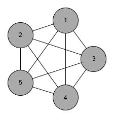

# Tiny Python library for graph drawing in [yEd](https://www.yworks.com/products/yed)

```Python
import yed

y = yed.Graph()

n1 = y.node(text="1", fill_color="#aaaaaa")
n2 = y.node(text="2", fill_color="#aaaaaa")
n3 = y.node(text="3", fill_color="#aaaaaa")
n4 = y.node(text="4", fill_color="#aaaaaa")
n5 = y.node(text="5", fill_color="#aaaaaa")

for n in [n2, n3, n4, n5]:
    y.edge(n1, n, target_arrow="none")
for n in [n3, n4, n5]:
    y.edge(n2, n, target_arrow="none")
for n in [n4, n5]:
    y.edge(n3, n, target_arrow="none")
for n in [n5]:
    y.edge(n4, n, target_arrow="none")

y.save("k5.graphml")
```

</img>

```Python
from random import randint, choice
import yed

y = yed.Graph()

nodes = []
for i in range(100):
    color = "#" + ("%02x" % randint(100, 255)) * 3
    nodes.append(y.node(text=i, fill_color=color))

for n in nodes:
    y.edge(n, choice(nodes))

y.save("random.graphml")
```

</img>
